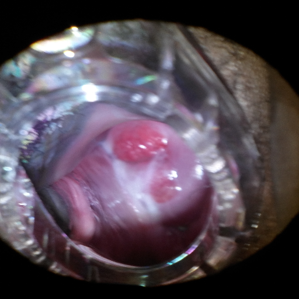
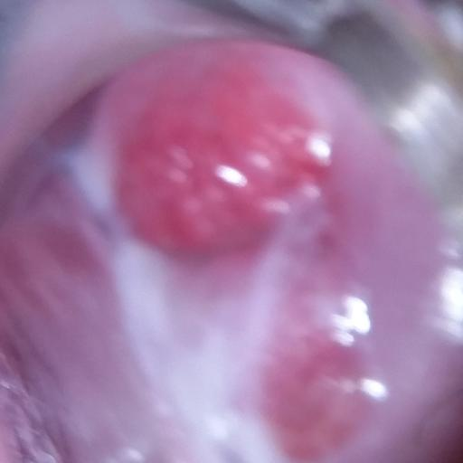
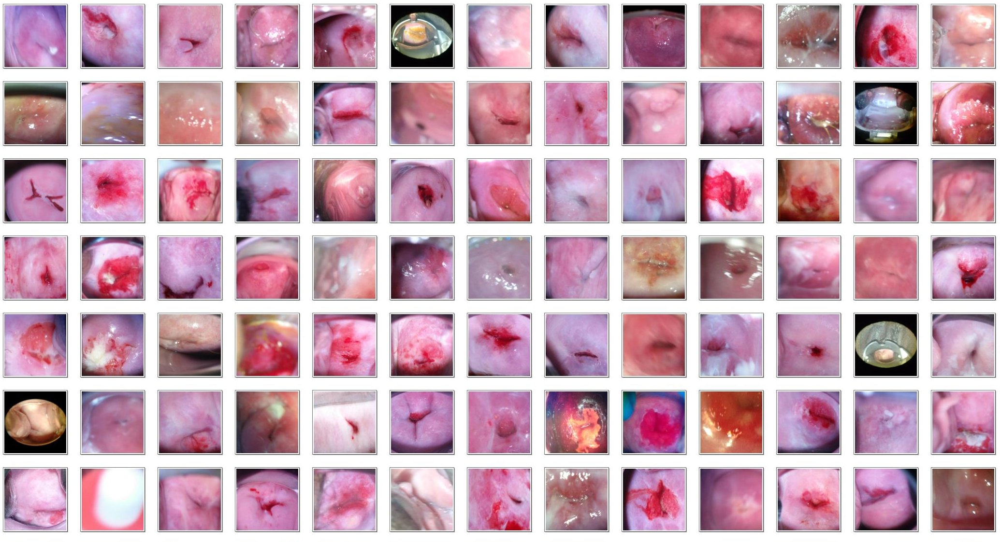

# UNet分割提取宫颈部位 
#### 人工智能在医疗领域的应用越来越重要。在众多危害人体健康的疾病中，宫颈癌是最常见的妇科恶性肿瘤。阴道镜是拍摄宫颈图片的主要方法，获取的宫颈图片后续再用于宫颈癌的筛诊。但阴道镜拍摄的图片通常包含有宫颈和不相关的信息，为了提高宫颈癌的筛诊准确率，本项目用UNet算法模型提取宫颈部位，后续再用提取了宫颈部位的图片筛查宫颈病变区域。

## 1 &nbsp;UNet网络结构 
##### UNet模型是通过下采样、上采样网络进行特征提取的，具体的网络结构如下代码。
	def create_model(img_height, img_width, nb_channels, learning_rate):
	    if K.image_dim_ordering() == 'th':
	        channel_axis = 1
	        inputs = Input((nb_channels, img_height, img_width))
	    else:
	        channel_axis = 3
	        inputs = Input((img_height, img_width, nb_channels))
	    print('K.image_dim_ordering={} Channel axis={}'.format(K.image_dim_ordering(), channel_axis))
	
	    # inputs = Input((1, img_rows, img_cols))
	    conv1 = Conv2D(32, (3, 3), padding="same", activation="relu")(inputs)
	    conv1 = Conv2D(32, (3, 3), padding="same", activation="relu")(conv1)
	    pool1 = MaxPooling2D(pool_size=(2, 2))(conv1)
	
	    conv2 = Conv2D(64, (3, 3), padding="same", activation="relu")(pool1)
	    conv2 = Conv2D(64, (3, 3), padding="same", activation="relu")(conv2)
	    pool2 = MaxPooling2D(pool_size=(2, 2))(conv2)
	
	    conv3 = Conv2D(128, (3, 3), padding="same", activation="relu")(pool2)
	    conv3 = Conv2D(128, (3, 3), padding="same", activation="relu")(conv3)
	    pool3 = MaxPooling2D(pool_size=(2, 2))(conv3)
	
	    conv4 = Conv2D(256, (3, 3), padding="same", activation="relu")(pool3)
	    conv4 = Conv2D(256, (3, 3), padding="same", activation="relu")(conv4)
	    pool4 = MaxPooling2D(pool_size=(2, 2))(conv4)
	
	    conv5 = Conv2D(512, (3, 3), padding="same", activation="relu")(pool4)
	    conv5 = Conv2D(512, (3, 3), padding="same", activation="relu")(conv5)
	
	    up6 = concatenate([UpSampling2D(size=(2, 2))(conv5), conv4], axis=channel_axis)
	    conv6 = Conv2D(256, (3, 3), padding="same", activation="relu")(up6)
	    conv6 = Conv2D(256, (3, 3), padding="same", activation="relu")(conv6)
	
	    up7 = concatenate([UpSampling2D(size=(2, 2))(conv6), conv3], axis=channel_axis)
	    conv7 = Conv2D(128, (3, 3), padding="same", activation="relu")(up7)
	    conv7 = Conv2D(128, (3, 3), padding="same", activation="relu")(conv7)
	
	    up8 = concatenate([UpSampling2D(size=(2, 2))(conv7), conv2], axis=channel_axis)
	    conv8 = Conv2D(64, (3, 3), padding="same", activation="relu")(up8)
	    conv8 = Conv2D(64, (3, 3), padding="same", activation="relu")(conv8)
	
	    up9 = concatenate([UpSampling2D(size=(2, 2))(conv8), conv1], axis=channel_axis)
	    conv9 = Conv2D(32, (3, 3), padding="same", activation="relu")(up9)
	    conv9 = Conv2D(32, (3, 3), padding="same", activation="relu")(conv9)
	
	    conv10 = Conv2D(nb_channels, (1, 1), activation='sigmoid')(conv9)
	
	    model = Model(inputs=inputs, outputs=conv10)
	    model.compile(optimizer=Adam(lr=learning_rate), loss=dice_coef_loss, metrics=[dice_coef])
    	return model

 

## 2 &nbsp;提取结果 
阴道镜拍摄的图片如下图所示：      
  
对阴道镜拍摄的图片用UNet网络提取宫颈部位，得到的宫颈图片如下：  

测试集上部分阴道镜图片提取结果：

 
